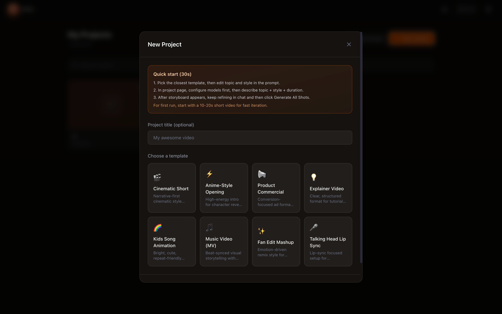
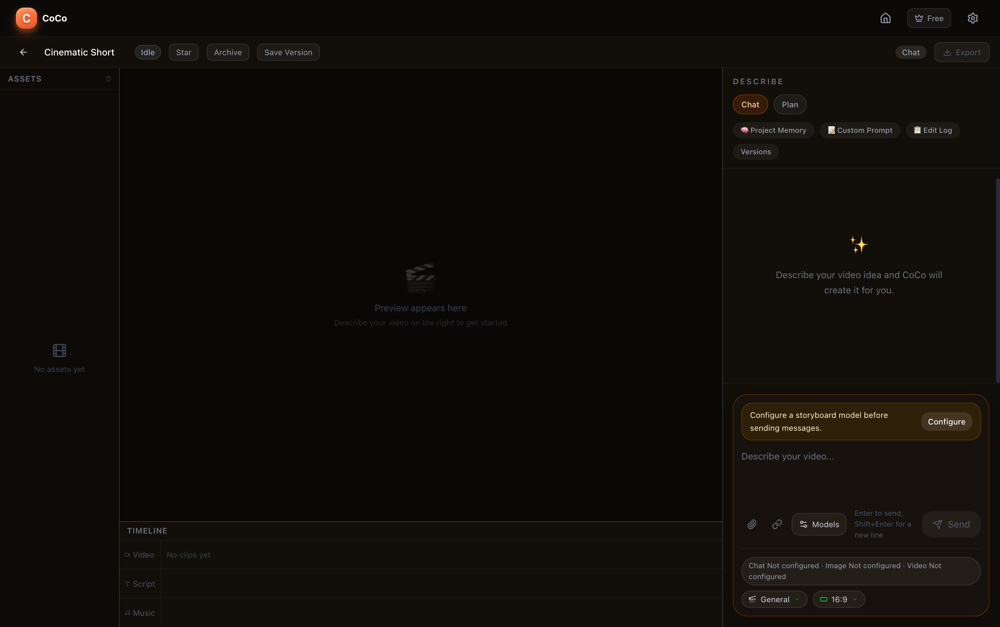

# OPENCOCO

OPENCOCO is the open-source edition of CoCo: an AI-assisted video editing workspace built with FastAPI, Next.js, and Electron.

<p>
  <a href="#english">English</a> |
  <a href="#中文">中文</a>
</p>


## English

### What It Is

OPENCOCO is the open-source edition of CoCo, an AI video creation and editing workspace built with FastAPI, Next.js, and Electron. It is an open AI video generation platform that can flexibly connect to almost any model stack and combine fragmented generated content into coherent long-form videos.

### Core Features

- Flexible model configuration: customize script models, image storyboard models, and video generation models
- Support version history, custom prompts, creation logs, and project memory
- Generate film-length videos from simple descriptions as long as you have enough tokens
- Unified editing workspace: manage preview, assets, script, music, timeline, and export in one interface
- AI-assisted iteration: continuously refine rhythm, style, structure, and expression through natural-language instructions
- Official product page: learn more about the commercial product direction and positioning at [openyc.vip/products/coco](https://openyc.vip/products/coco)

### Official Website & Contact

- Product website: [openyc.vip/products/coco](https://openyc.vip/products/coco)
- Contact email: [allensong1019@gmail.com](mailto:allensong1019@gmail.com)

### Screenshots

#### 1. Landing and product entry

The homepage presents the product promise clearly: create and edit AI videos through conversation, with fast entry into the workflow.


#### 2. New project and template selection

Users can start quickly from structured templates instead of building every project from scratch.



#### 3. Main editing workspace

The editor brings together project chat, preview, assets, timeline, and export actions in one screen.



### Downloads

- Source code: available immediately from this repository via `git clone` or GitHub's `Download ZIP`
- Desktop application builds: available from GitHub Releases when maintainers publish tagged releases
- If the Releases page has no binaries yet, build locally by following the setup steps below

### Repository Layout

- `backend/`: FastAPI API, auth, project storage, memberships, generation workflows
- `frontend/`: Next.js app UI
- `electron/`: desktop shell, bundling, auto-update integration

### Quick Start

#### 1. Install dependencies

```bash
# Backend
python3 -m venv backend/.venv
backend/.venv/bin/pip install -r backend/requirements.txt

# Frontend
cd frontend && npm install

# Electron
cd ../electron && npm install
```

#### 2. Prepare environment files

```bash
cp backend/.env.example backend/.env
cp frontend/.env.example frontend/.env.local
```

Fill in only the variables you need. For a local-only setup, most optional cloud and payment variables can stay empty.

#### 3. Start the app

Infrastructure-only setup:

```bash
./start.sh
```

Full desktop development flow:

```bash
./start-dev.sh
```

Manual web-only flow:

```bash
docker-compose up -d postgres redis
cd backend && .venv/bin/uvicorn main:app --reload
cd frontend && npm run dev
```

## 中文

### 产品介绍

OPENCOCO 是 CoCo 的开源版本，一个基于 FastAPI、Next.js 和 Electron 构建的 AI 视频创作与编辑工作台。他是一个开放式的AI生成视频的平台，可以灵活的几乎所有模型，可以把碎片化的生成内容组合成连贯的长视频。

### 核心特点

- 灵活配置模型：你可以自定义脚本模型、图片分镜模型、视频模型
- 支持版本回溯、自定义提示词、创作日志、项目记忆
- 简单描述就可以生成电影时长的视频，只要你有足够多的token
- 一体化工作台：把预览、素材、脚本、音乐、时间线和导出整合到同一个界面
- AI 辅助迭代：可通过自然语言持续修改节奏、风格、结构和表达方式
- 产品官网：可在 [openyc.vip/products/coco](https://openyc.vip/products/coco) 查看产品定位与更多介绍

### 官网与联系

- 产品官网：[openyc.vip/products/coco](https://openyc.vip/products/coco)
- 联系邮箱：[allensong1019@gmail.com](mailto:allensong1019@gmail.com)

### 产品截图

#### 1. 首页与产品入口

首页重点突出“用对话来创建和编辑 AI 视频”的核心定位，用户可以直接进入创作。


#### 2. 新建项目与模板选择

用户可以从多种预设模板快速开始，而不是每次都从空白项目搭建。


#### 3. 主编辑工作区

主界面把聊天、预览、素材区、时间线和导出能力整合在一起，便于边描述边修改。


### 下载说明

- 源代码：仓库公开后即可直接通过 `git clone` 或 GitHub 的 `Download ZIP` 获取
- 桌面应用：只有在维护者发布 GitHub Releases 里的预编译安装包后，用户才能直接下载运行
- 如果 Releases 页面里还没有二进制文件，当前就需要先拉源码再本地构建

### 仓库结构

- `backend/`：FastAPI 后端、认证、项目存储与生成流程
- `frontend/`：Next.js 前端界面
- `electron/`：桌面壳层、打包与自动更新逻辑

### 快速开始

#### 1. 安装依赖

```bash
# Backend
python3 -m venv backend/.venv
backend/.venv/bin/pip install -r backend/requirements.txt

# Frontend
cd frontend && npm install

# Electron
cd ../electron && npm install
```

#### 2. 准备环境变量

```bash
cp backend/.env.example backend/.env
cp frontend/.env.example frontend/.env.local
```

按需填写配置即可。仅本地体验时，大多数可选云端或支付配置都可以先留空。

#### 3. 启动项目

仅启动基础依赖：

```bash
./start.sh
```

完整桌面开发流程：

```bash
./start-dev.sh
```

只跑 Web 开发流程：

```bash
docker-compose up -d postgres redis
cd backend && .venv/bin/uvicorn main:app --reload
cd frontend && npm run dev
```

## License

This repository is released under the MIT License. See [LICENSE](LICENSE).
